# TESTING DOCUMENT | **Wet Paws** | Dog Walking and Sitting Services

## OVERVIEW

This being my first ever project in Web Development, I need to start saying that I did encounter quite a few obstacles that made me start the project from the begining once or twice (as seen in a commit history).

As my project started taking form and I could visualize it on a browser as I went along, I felt more and more confident on what i was doing, even trying new things like adding music tracks and trying different hover styles.

But I still had to redo a few things that did not quite work as I planned, like loading libraries, js, jQuery...

From the very beginning I used Google Chrome Dev Tools to style and fix my code, so thanks to that I found it much easier to see real time changes and add the write css/code to my workspace.

Once finished, I planned to test my site on a few different phones, laptop, tablet and desktop:

- Samsung Galaxy S8+ (My personal device) (mobile device)
- Samsung A70 (mobile device)
- Samsung J7 (mobile device)(528px - 5.5")
- Iphone 11 (mobile device)
- Xaomin (mobile device)

- Samsung S5 (tablet)

- HP Envy 13" (laptop)

  - Mozilla Firefox (browser)
  - Microsoft Edge (brower)
  - Google Chrome (browser)
  - Opera (browser)

- PC desktop 27" screen

  - Google Chrome (browser)

- PC desktop 32" screen
  - Mozilla Firefox (browser)
  - Microsoft Edge (brower)
  - Google Chrome (browser)
  - Opera (browser)

## Table of Content

1. [USER STORIES](#user-stories)
2. [FAVICON TEST](#favicon-test)
3. [VALIDATOR CHECKS](#validator)
   - [HTML](#html-validator)
     - Index.html
     - Services.html
     - Contact.html
   - [CSS](#css-validator)
4. [LIGHTHOUSE TESTING](#lighthouse-testing)
5. [BROWSER COMPATIBILITY](#browser-compatibility)
6. [DEVICE RESPONSIVENESS](#device-responsiveness)
7. [BUGS](#bugs)

## USER STORIES TESTING

- As a visiting user I want to:

  - _"Find out what the company is about."_

    - When the user lands on any of the pages, the first thing they see it's the logo representing a paw and the name of the company (Wet Paws), followed by a summed up version of the company's nature to be (Dog walking and sitting). Just by seeing the logo once, the user will get a clear idea of the intention of the business.
    - The hero image hints that the business is related to dogs. All hero images represent dogs, but they are all different so the user knows there has been some change when they have clicked on one of the navigation links.

      

    - For users who want to learn more about the business and the owner, there is an informative section called About Us where the owner explains what the company is about. The section also has a picture of the owner's dog as an introduction to the company's owner and to create a feeling of trust and showing the users that the owner has knowledge of dog care.
      This section also tells the user Who the owner is, Where the company is located, Why to hire them and the name of their own dog to make it more personal.

      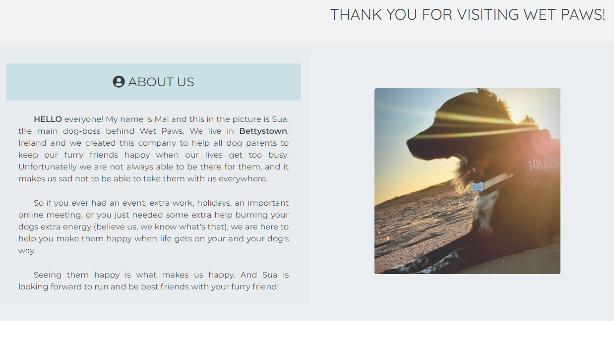

    - for the comfort of the user, the navbar has a section called About Us that can be reached from any of the other pages. The link is highlighted on a darker color to suggest that the user is seeing the page with the company's information

      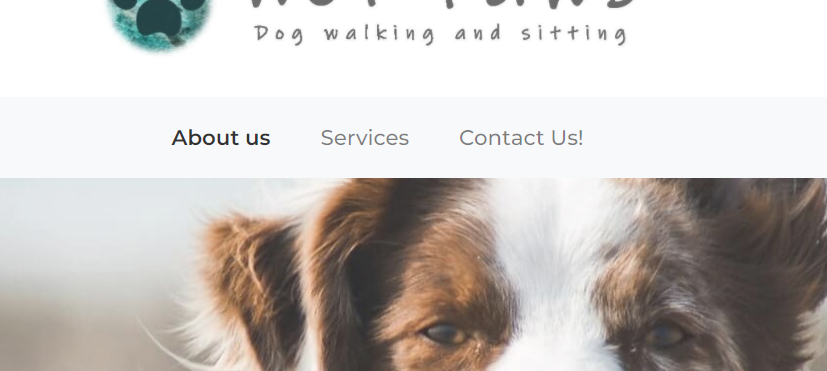

  - _"Easily visualize and understand what services the company offers."_

    - on the navbar, there is a tab called Services so the user can jump directly to that page and see the services the company offers.

      

    - when the user scrolls down from the hero image, there is a header that lets the user know that they are seeing the services section, and this contains 4 cards each with a highlighted heading with the title of the service and a shot but concise explanation about each service

      
      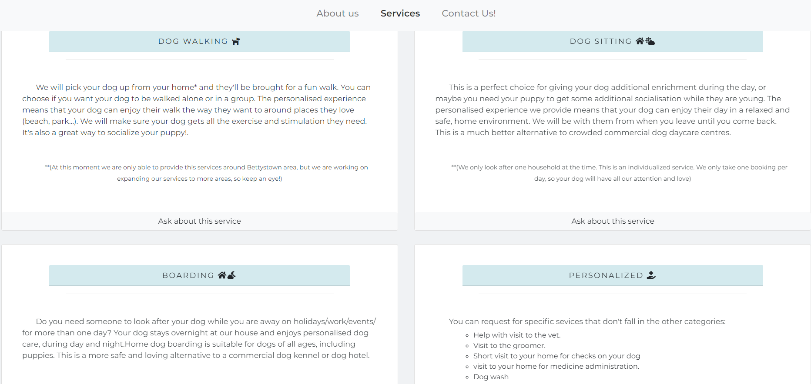

  - _"Be able to use and book one or more services the company has to offer."_

    - Under each service card there is an area saying "Ask more about this service" which the user can click to be redirected to the contact form and be able to ask more questions to the owner.

      

    - The "Ask more about this service" will redirect the user to the contact form where there is a section the user to select an option to be booked or enquired about. This section is not required so the user can write their own requirement or book more than one service on the Tell us more textarea, located just below the radio button service choices:

      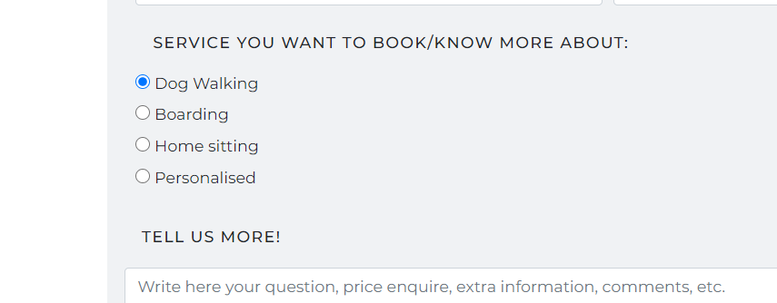

  - _"Be able to use the contact form for the business and service enquiries."_

    - To be able to quickly access the contact form from any part of the website, the words "form/contact form/Ask about this form (button)" have been linked to the form section. The firts two words have been underlined and the font weight increased to hint the user that the word is clickable. Ask about this service button changes the background color when hovered over to entice the user to click on it.

      
      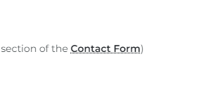
      

    - The navbar has a direct link to the contact form called "Contact Us!" to make the user feel confortable to contact the company with any question the user might have:

      

    - The contact form is minimal with no pictures to make sure the user doesn't get overwhelmed with information and fields to be filled. For users who need help with the information needed on each field, there is a placeholder test to hint and help the user.

      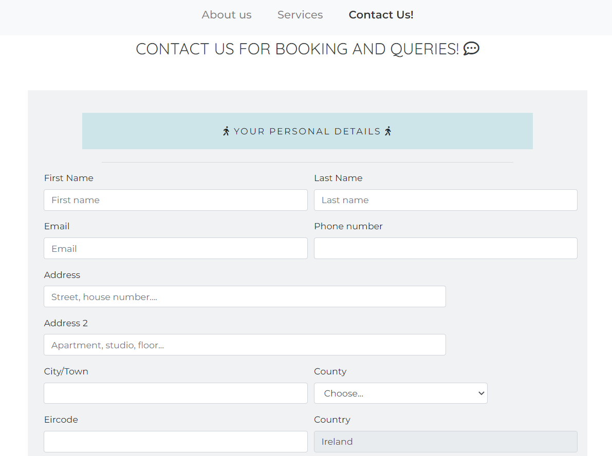
      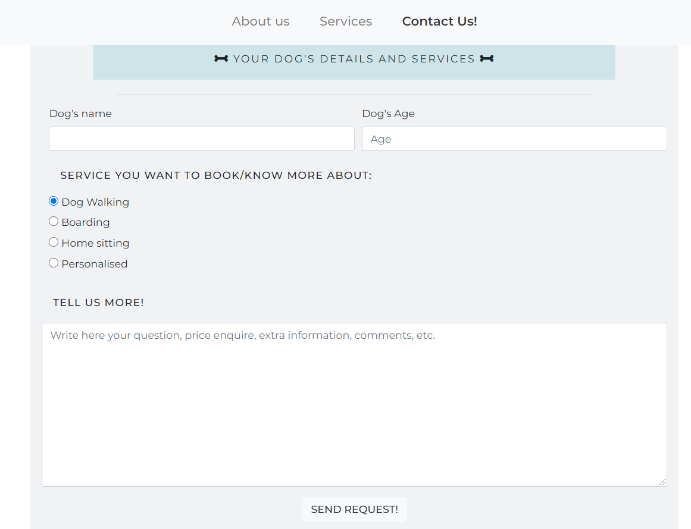

  - _"Have the option to personalize the services offered."_

    - Within the services section, the user can find a card called "Personalised", refering to a personalization of the services offered or the posibility of asking for a service not listed on the other cards. The user is informed to make an inquire in the contact form inside the "Tell us more" section, asking for the posibility and conditions of their personal request.

      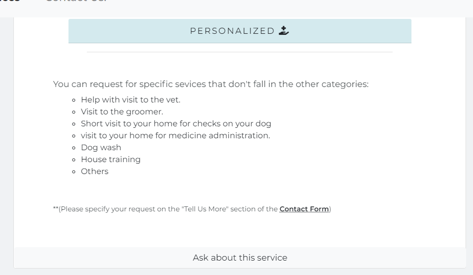

  - _"Feel that the company cares and I can trust them caring for my loved dog by seeing other people's reviews."_

    - The user can find reviews by customers on a section located below the services. They can find a review for each one of the services offered, and for more realism each one of the reviews has a real dog at the top, representing the actual dog that the company looked after personally

      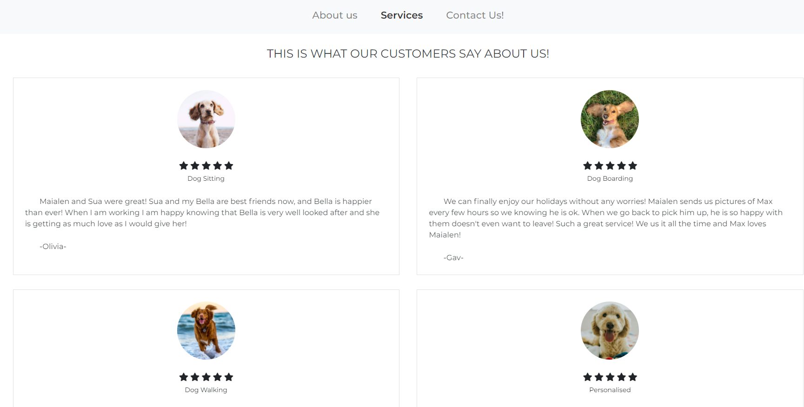

    - The user can also find a small gallery with pictures taken of dogs under the owner's care while they are with her. The users can see what other dogs look like and they can also see their own dog's picture, giving the user feeling of company transparency and relieve seeing their dogs well when they are not around

      

  - _"Be able to know more about the owner by having the option to personally meet them."_

    - For those users who want to meet the owner personally before deciding if they want to book any of the services, there is a section called "Meet Us" where the user can find information about meeting times, location and if they prefer, a link to the contact form to book a private walk with the owner and see the compatibility between the owner's dog and the user's dog.

      

  - _"Know the location of the business and know where those services are offered."_

    - Just above the footer there is a location map where the user can see the specific loaction of the company on the map

      

    - on the footer the user can find information about the location, county and country of the business, as well as the name of the owner and their dog's.

      

  - _"Get in touch with the business easily by having contact details clearly available."_

    - In the navbar the user can find a direct link that will bring them to the contact form

      

    - the navbar is sticky so the user can access any of the pages links at any moment without the need of scrolling up. The sticky navbar is responsive on small screens too, as the user needs to scroll more to go to the top

      
      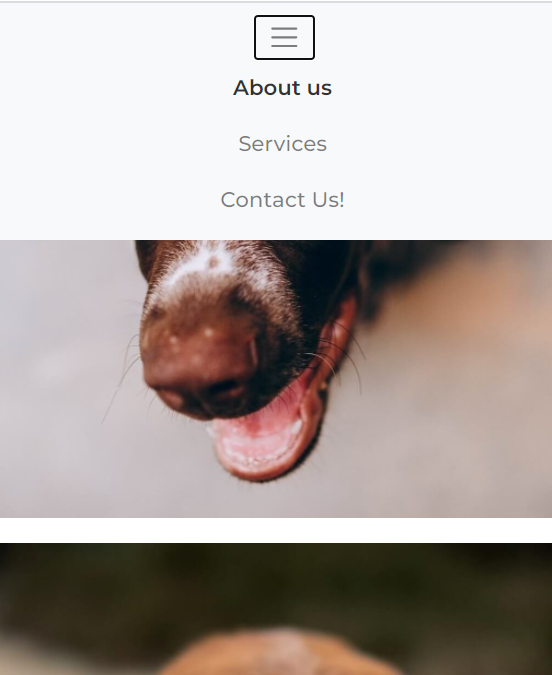

    - The user has also the posibility of contacting the company by phone or email using the information found at the footer

      

    - for those users that submit the form but they require faster contact, on the feedback form they can find a note encouraging the user to call the owner anytime at the phone provided

      

  - _"Find social links to be able to follow the business in social media platforms."_

    - for those users who want to follow the company on different social media platforms, there are links on the footer under the header called "follow our adventures". These links open on separate tabs for better user experience.

      

    - for users that have a premium spotify account, there is a section where there is three playlists, so the users can enjoy while they are walking their own dogs.

      

---

## FAVICON TEST

I noticed when I introduced the first and second favicon I could not see the shape on the brower tab as they were very
blurry and unidentifyable, so I created a new favicon with bold black color and simple shape, so it can be easily identified
in between the rest of the opened tabs. This change has improved the user experience as I can identify the site's tab in one
fast look.

- [Favicon 1](docs/testing/favicon_test/test-favicon1.png)
- [Favicon 2](docs/testing/favicon_test/test-favicon2.png)
- [Chosen Favicon](docs/testing/favicon_test/test-favicon3.png)

As seen in the examples above, the new favicon is visually more appealing than the first two.

---

## VALIDATOR:

As I wrote my code during the whole project, I continuouly checked my code using [W3 Validator](https://validator.w3.org/#validate_by_uri) to make sure I fixed my code as I wrote it. At the end of the project I ran all the finished pages and made sure all the errors were fixed (see below).

As a css validator I also used [w3 Validator](https://jigsaw.w3.org/css-validator/) to make sure it checked my style.css file to CSS level 3 + SVG standards.

(See passed validator results at the end of [HTML](#results-after-fixing-validator-errors) and [CSS](#results-for-css-validator-check) sections.

### HTML VALIDATOR:

Test results and errors to be fixed (after the first check):

- The type attribute is unnecessary for JavaScript resources.

  - I removed the type attribute form them.

- Some of the images are not loading and the path seems to be broken

  - I checked with dev-tools on google chrome.
  - I fixed this fixing the source path where I made a mistake (my assets
    directory is called static, but I wrote assets/images)
  - It's fixed. All pictures are showing as they are meant to and they are responsive

- missuse of Aria attribute (Aria-label) on line 65 (span aria-label="image of an ...").
  - To make it accessible and have an image description I added a role="img" to be able make a relevant description of the purpose of the parent element.

INDEX.html

- line 152: text-center not allowed on div

  - fixed error adding class="text-center"

- line 155: Attribute target not allowed on element iframe at this point.

  - removed all target attributes from iframe elements.

- line 155: Attribute autoplay not allowed on element iframe at this point.

  - removed autoplay from iframe elements

- line 158: The frameborder and allowtransparency attribute on the iframe element are obsolete.

  - to comply with the w3 validator, I added inline styles to the iframes (style="border:none;") and removed allowtransparency="true as I didn't need it.

- line 172: Bad value 100% for attribute width on element iframe: Expected a digit but saw % instead.

  - removed width="100%" and added class="w-100" to the map iframe

- line 170: section is missing a header
  - added h2 to map section for better accessibility and organization of information

SERVICES.html

- line 148: No p element in scope but a p end tag seen.

  - error: a ul element was inside the p element. To fix this i closed the p element in line 138 and put the ul as a child of div (card-body)

- line 170: Attribute heigh not allowed on element img at this point.

  - Fixed by removing height and width from the img element and added them using css under .img-responsive (style.css line 350, 351)

- line 170: An img element must have an alt attribute

  - added alt attribute to all img elements within article element on lines 170, 191, 214, 235.

- line 162: Article lacks heading. Consider using h2-h6 elements to add identifying headings to all articles.
  - moved h2 from line 164 to line 163 over the div-reviews element.

CONTACT.html

- line 169: Element h5 not allowed as child of element label in this context.
  - removed h5 element from label. I added the id="tell-more" to the label and styled the same way as h5 (style.css line 397)

---

Results after fixing Validator errors

- [Index.html Validator result](docs/testing/validator/index.html-w3-pass.png)

- [Services.html Validator result](docs/testing/validator/services.html-w3-pass.png)

- [Contact.html Validator result](docs/testing/validator/contact.html-w3-pass.png)

- [feedback.html Validator result](docs/testing/validator/feedback.html-w3-pass.png)

---

### CSS VALIDATOR

Results for CSS validator check

- [CSS Validator result](docs/testing/validator/CSS-validator-pass.png)

---

### LIGHTHOUSE TESTING

Using DevTool's Lighthouse tester, I checked all pages on mobile and desktop to make sure the scores were as high as I posibly could. Below you can find the results and scores of first time tests and after implementing suggestions that the tool offered:

(All tests were carried on the same way: I cleared cache data, opened new incognito page (Chrome and Edge), and loaded tested each page twice. Same procedure was used for every page for mobile and web)

- **Mobile**

  - Index.html Lighthouse test:

    - [Before](docs/testing/lighthouse/index-phone-before) implementing changes:
      - The performance score was very low and in red. This was due to very big images and unused javascript libraries. To fix that I reduced all images with Tinypng and cropped them to make equal squares. I also changed two of the images as it was impossible to make them any lower on weight without pixelating them and they ended up not looking too good. I also changed the grid system so all pictures show on top of each other in mobile view.
    - [After](docs/testing/lighthouse/index-phone-after) following lighthouse suggestions:
      - I managed to increase the very low performance score to 82%. Although this is not ideal, I found it very difficult to implement any more changes as this meant to add attributes to elements that made the validator fail. So I decided to leave the index at this level until I have more time for further changes and improvements.

  - Services page Lighthouse test:

    - [Before](docs/testing/lighthouse/services.html-phone-before.png) implementing changes
      - as in the index page, the performance score was quite low because of the weight of the images
    - [After](docs/testing/lighthouse/services-phone-after.png) following lighthouse suggestions:
      - once I implemented the suggestions given by the lighthouse tool, the score increased to 86%. I decreased the size of the images and added meta data to the head for better SEO (%100)

  - Contact page Lighthouse test:

    - [Before](docs/testing/lighthouse/contact.html-before-phone.png) implementing changes
    - [After](docs/testing/lighthouse/contact.html-phone-after.png) following lighthouse suggestions:
      - although the performance before was quite low, implementing lighthouse suggested changes increased the performance of the mobile test quite significantly, but we can see the biggest improvement in Best practices, where the score went up to 93%.

  - Feedback page Lighthouse test:
    - [Before] This feature was added at the very end of the project, when I noticed some issues as I was testing all the pages (see bugs for more info on error 501). Because of this, I forgot to take any screenshots of the lighthouse testing before.
    - [After](docs/testing/lighthouse/lighthouse-feedback-after.png)

- **Web**

Because I focused on mobile first approach for the testing part too. All the improvements made to increase the performance on the mobile view, has greatly benefited the web performance too. This changes included compression of images, removal of unused code and css, reload of better sources for bootstrap/fontawesome libraries...

- Index web page Lighthouse test:

  - [Before](docs/testing/lighthouse/index.html-before-web.png) implementing changes
  - [After](docs/testing/lighthouse/index.html-after-web.png) following lighthouse suggestions:
    - in the results we can see that the best practices did not increase too much. This was due to the ratio of the image I chose to display on the grid of About us section within Index.html. Whilst lighthouse was advicing to change this ratio to it's original size, I decided not to change it, as I found this to be much bigger than I intended it to be, and this would consequently affect the performance on the mobile view.

- Services web page Lighthouse test:

  - [Before](docs/testing/lighthouse/services.html-before-web.png) implementing changes
  - [After](docs/testing/lighthouse/services.html-after-web.png) following lighthouse suggestions:
    - We can clearly see in these results that eventhough the performance of the services page was already high enough, making changes after the mobile lighthouse test increased all the parameters even higher.

- Contact web page Lighthouse test:

  - [Before](docs/testing/lighthouse/contact.html-before-web.png) implementing changes
  - [After](docs/testing/lighthouse/contact.html-after-web.png) following lighthouse suggestions:
    - This has been the best results out of all the pages. This is due to the simplicity of the page, minimal structure and no heavy images to be loaded. Still, we can see an improvement after the changes lighthouse suggested.

- Feedback web page Lighthouse test:
  - [Before] This feature was added at the very end of the project, when I noticed some issues as I was testing all the pages (see bugs for more info on error 501). Because of this, I forgot to take any screenshots of the lighthouse testing before.
  - [After](docs/testing/lighthouse/feedback-after-lighthouse.png)

## DEVICE RESPONSIVENESS

I continuouly tested the project on various devices from the very beginning. I mostly used Google Chrome DevTools, but as soon as I deployed the website (GitHub Pages) I pushed my code very often to see the results of changes in real time on my own personal devices (Samsung S8+, Samsung A70, HP Envy 13", Samsung 5Se Tablet) to make sure the site was responsive on various viewports.

Apart from that, I used an online app by [Media Genesis](https://responsivedesignchecker.com/) to check responsiveness on those screens I did not have access to. The results of these testings are below (the results of the tests were written on a xcel and converted to png, so the excel was broken in 4 parts):

- [Part1](docs/testing/device+browser-tests/device-responsiveness-1.png)
- [Part2](docs/testing/device+browser-tests/device-responsiveness-2.png)
- [Part3](docs/testing/device+browser-tests/device-responsiveness-3.png)
- [Part4](docs/testing/device+browser-tests/device-responsiveness-4.png)

Most phones share screen sizes so on those I did not see many changes. Saying that, on narrow screens (for example in the Galaxy Fold with a viewport of 286x653) some on the headings (especially on headings in services.html) broke on the middle. To fix these, I added some extra css to media queries for screens with max width 450, reducing margings to fit to screen better. (find these in style.css lines 487 - 509)

- Samsung Galaxy S8+ (My personal device) (mobile device): As mentioned before, I continuously tested my code on my own mobile device as I went writting and styling the code, so I could see how it looked on mobile devices. Thanks to testing on my phone I noticed some headings had to be made smaller so they did not look oversized. Below there is screenshots of a last test done on this device:
  - [Samsung S8+ screenshot index](docs/testing/device+browser-tests/Samsungs8+screenshot-index.jpg)
  - [Samsung S8+ screenshot services](docs/testing/device+browser-tests/samsungs8+screenshot-services.jpg)
  - [Samsung S8+ screenshot contact](docs/testing/device+browser-tests/samsungs8+screenshot-contact.jpg)
  - [Samsung S8+ screenshot feedback](docs/testing/device+browser-tests/Samsungs8+screenshot-feedback.jpg)

- Samsung A70 (mobile device)
- Samsung J7 (mobile device)(528px - 5.5")
- Iphone 11 (mobile device)
- Xaomin (mobile device)

- Samsung S5 (tablet)

- HP Envy 13" (laptop)

  - Mozilla Firefox (browser)
  - Microsoft Edge (brower)
  - Google Chrome (browser)
  - Opera (browser)

- PC desktop 27" screen
  - Google Chrome (browser)
- PC desktop 32" screen
  - Mozilla Firefox (browser)
  - Microsoft Edge (brower)
  - Google Chrome (browser)
  - Opera (browser)

## BUGS

1.  h1 font-size not reducing for big screens

    - Tried to make index.html h1 smaller in font-size for larger screens but something is not lettig the size get smaller.
      - When testing the responsivness of it, I can see the font-size
        reducing, but not in higher resolution screens.
      - It was a cache issue. After clearing the cache and restarting google Chrome, it's responsive.

2.  Bootstrap toggle collapse is not working

    - The toggle icon is responsive and it appears when tested with dev-
      tools, but the dropdown menu is not working
    - SOLUTION: I noticed i forgot to place the jquery needed to make the Bootstrap
      JavaScript to work properly at the end of the file, before </body>.

3.  In mobile screen, the dropdown items are not showing alignedand centered under the toggle icon

    - Fixed this removing mr-5 from class. This was giving nice looking spacing between the nav-links,
      but when rendering to phone view it gave too much margin in the right hand side.
    - To add spacing between the nav-links I added padding between them.

4.  In mobile screen, the card headings (h4) break and separate to the next line

    - I noticed in line 310 on the style.css file the margin was too large (margin: 20px 100px)
    - Changed the margin right and left to 70px, so when rendered to mobile, the h4 doesn't break in two
      and it's still balanced with the body of the cards, as well as the heading on the contact page.

5.  on desktop view, the review columns would render with 140px or margin in left and right.

    - SOLUTION: added a media queries for screens 992 and higher so the max width is 90%.
    - style.css line 384 +.

6.  on mobile view, there is a line across the footer dividing the footer in two colors.

    - I changed the max-height on line 134 of syle.css for min-height to match the height of the container content and added h-100 to the footer.
    - This has fixed the issue.

7.  When submitting the form, once filled the required fields and submitting the form, the page gave a 501 Error as showing in the image below.

    - I tried to fix this by adding another html page called response.html. I thought adding this the CTA button would ask the user to fill the required fields and then redirect them to a feedback page. But this did not work as when adding the response.html, the required attributes stopped working.
    - I contacted Code Institute tutor help this were the outcomes: - Scott suggested instead of trying to add another page I could use a modal to give the user a feedback. This wouldn't require to have a separated page and it would avoid the error from showing. But it also meant I had to add JS and jQuery, and eventhough I tried my hardest to learn fast and try to implement ( "form" ).submit(function() { into my head for responsiveness, the modal kept opening over the required fields and the function would not do anything for me.

          - I had to contact them again and Tim helped me solving the issue. Unfortunatelly at this time of the course my skills are not advanced enough to add any JavaScript or functions. Tim advised me to remove the modal, as it wouldn't work as I intended without JS. After removing all code related to this, I noticed I still got the 501 error.

              - Tim noticed my form method=POST and action="/" were stopping my page from refreshing. So we changed the method to GET and removed action all together. This has solved the issue: if the user tried to submit the form without filling the required fields, the form won't submit and the user will get a notification under or over the field to be filled. When all information has been correctly filled and the user pushes the CTA button, the page will refresh leaving all fields empty to be used again.
              - Althought I would have liked to have some sort of feedback for the user to receive when they submitted the form, this couldn't be done at this time, but it would be implemented as a feature on future releases. (see [features left to implement](README.md) on README.md]

      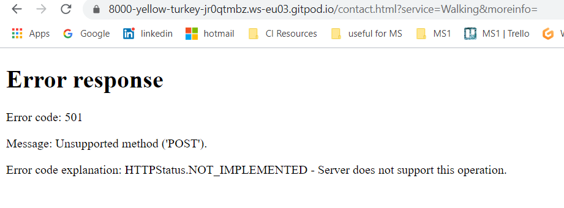

    - EDIT & UPDATE: SOLUTION: my mentor Rohit thought that as an improved user experience users should be directed to once they have submitted the form. After all the failed trials with tutor support, Rohit found a solution to this problem:
      - on line 128 of contact.html he suggested to add :
      <form
         action="feedback.html"
         class="container-fluid contact-form"
         id="contactform"
         method="GET"
       >
      - by doing this the form redirects the user (after filling the required fields) into another page created in my workspace called feedback.html. Inside this page I created a thank you note and a cta button redirecting the user back to the home page.

### KNOWN BUGS

- When clicked on the Spotify music list it plays 30 seconds of the list as a teaser for the song. The user needs to log into their spotify account to play the whole list. Premium account is needed to access Spotify.
  - There is three playlist each embedded inside an iframe. During the testing I noticed that if I play a second playlist, the first one does not stop, but as it's an external code, I do not have the way to fix this with my actual knowledgde and skillset. So the playlists have to manually be paused, otherwise they all play at the same time.

---

Back to [README.md](README.md)
